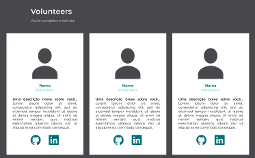

<h1 align="center">
  
</h1>
 
 
<h1 align="center">
  
</h1>

Hacktoberfest é uma celebração de um mês de software de código aberto organizada pela <a href="https://www.digitalocean.com/" target="_blank">DigitalOcean</a>

 
 

  <a href="#memo-sobre">Sobre</a>&nbsp;&nbsp;&nbsp;|&nbsp;&nbsp;&nbsp;
  <a href="#floppy_disk-tecnologias">Tecnologias</a>&nbsp;&nbsp;&nbsp;|&nbsp;&nbsp;&nbsp;
  <a href="#computer-projeto">Projeto</a>&nbsp;&nbsp;&nbsp;|&nbsp;&nbsp;&nbsp;
  <a href="#family_woman_woman_girl_girl-contribuir">Contribuir</a>&nbsp;&nbsp;&nbsp;|&nbsp;&nbsp;&nbsp;
  <a href="#purple_heart-desenvolvimento">Desenvolvimento</a>

 
 

## :memo: Sobre

 
 
<h3 align="center">"... Se você é uma pessoa desenvolvedora, estudante aprendendo a programar, anfitrião de eventos ou empresa de qualquer tamanho, você pode ajudar a impulsionar o crescimento do código aberto e fazer contribuições positivas para uma comunidade cada vez maior"</h3>
(Conteúdo do site oficial do <a href="https://www.digitalocean.com/" target="_blank">Hacktoberfest 2020</a>)

 
<h4>🌎  No intuito de colaborar e incentivar a participação de mais mulheres na comunidade  open source , um pull request  por vez, nós do <a href="https://www.womenwhocode.com/recife" target="_blank">Women Who Code Recife</a>, criamos um projeto para participarmos desta causa incrível, e toda comunidade poder colaborar com o projeto e completar os desafios </h4>
 

🎯 Antes de começar, garanta que você já faça parte da nossa comunidade em Recife e se inscreva na páginal oficial de Recife no <a href="https://www.womenwhocode.com" target="_blank">Women Who Code</a> - <stong><a href="https://membership.womenwhocode.com/email">Inscrições clicando aqui ✅</a></stong>

  

📲  <strong>Conheça e nos acompanhe em nossas redes sociais:</strong>

<h3 align="center">
  
  
  
  
  
  
  
</h3>
 
 
 

## :floppy_disk: Tecnologias

 

Este projeto foi desenvolvido com as seguintes tecnologias

 
<ul>
  <li><a href="https://developer.mozilla.org/pt-BR/docs/Aprender/JavaScript" target="_blank">JavaScript</a></li>
  <li><a href="https://reactjs.org/" target="_blank">ReactJs</a></li>
  <li><a href="https://pt-br.reactjs.org/docs/hooks-intro.html" target="_blank">React Hooks</a></li>
  <li><a href="https://pt-br.reactjs.org/docs/react-dom.html" target="_blank">React DOM</a></li>
  <li><a href="https://github.com/facebook/create-react-app/tree/master/packages/react-scripts" target="_blank">React Scripts</a></li>
  <li><a href="https://styled-components.com/" target="_blank">Styled Components</a></li>
  <li><a href="https://www.npmjs.com/package/styled-normalize" target="_blank">Styled Normalize</a></li>
</ul>
 
 

## :computer: Projeto

 

O projeto consiste em uma aplicação one-page que foi inspirado na página oficial do Hacktoberfest 2020.  Nesta aplicação apresentamos o Hacktoberfest, Women Who Code e o <storng>Women Who Code Recife</storng>.

Logo abaixo uma seção onde é possível identificar um menu com categorias de partição na comunidade. Neste projeto cada pessoa poderá contribuir acrescentando um card na categoria de participação em que se identifica no WWCode Recife: Directors, Evangelists, Leads, Volunteers e Members.

 
 

<a lign="center" href="https://www.figma.com/file/3F1RZgqXn7iLza3s5rFHyF/WWCode-Recife-in-Hacktoberfest?node-id=0%3A1" target="_blank">🎨  Clicando aqui </a> é possível verificar o layout que foi desenvolvido no Figma

 
<h3 align="center">

</h3>

 
<h5><strong> 🖥️ Projeto web inicial </strong> </h5>
<h2 align="center">

</h2>
 
<h5><strong> 📱 Projeto versão responsiva </strong></h5>
 
<h2 align="center">

</h2>
 

## :family_woman_woman_girl_girl: Contribuir

 

Você poderá contribuir acrescentando um card na sessão em que você identifica sua participação oficial no WWCode Recife dentro das modalidades: 

<h5 align="center">Directors  |  Evangelist  |  Leads  |  Volunteers  |  Members</h5>

Você contribuirá com um destes cards abaixo na categoria pertinente, contendo seu nome, uma breve descrição sobre você, suas redes sociais profissionais (LinkedIn e Github) e sua foto será exibida através do link da sua foto do perfil do Github

    

 
<h5 align="center">👩🏿‍💻👩🏻‍💻👩🏽‍💻👩🏾‍💻👩🏼‍💻 Para contribuir <a href="CONTRIBUTING.md">siga estas orientações</a>.</h5>
 
 

## :purple_heart: Desenvolvimento

 
 
<table>
  <tr>
    <td align="center" style="border: none;">
      <a href="https://github.com/alinecbsr">
        
         
        
          <b>Aline Rosa</b>
        
      </a>
       
      
<scan title="Code">💻</scan>|<scan title="Documentation">🎨</scan>|<scan title="Bugs">🐛</scan>

    </td>
        <td align="center" style="border: none;">
      <a href="https://github.com/simoneas02">
        
         
        
          <b>Simone Amorim</b>
        
      </a>
       
      
<scan title="Code">💻</scan>|<scan title="Documentation">📖</scan>|<scan title="Bugs">🐛</scan>

    </td>
    <td align="center" style="border: none;">
      <a href="https://github.com/willany">
        
         
        
          <b>Willany Silva</b>
        
      </a>
       
      
<scan title="Code">💻</scan>|<scan title="Bugs">🐛

    </td>
    <td align="center" style="border: none;">
      <a href="https://github.com/elainemanoelle">
        
         
        
          <b>Elaine Manoelle</b>
        
      </a>
       
      
<scan title="Code">💻</scan> | <scan title="Bugs">🐛

    </td>
  </tr>
</table>
